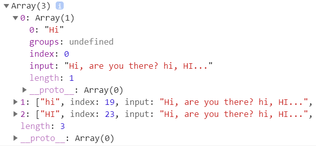

## **Introduction to regular expressions in JavaScript.** 

A regular expression is a string that describes a pattern e.g., **email addresses** and **phone numbers.**

In JavaScript, regular expressions are objects. JavaScript provides the built-in RegExp type that allows you to work with regular expressions effectively.

Regular expressions are useful for searching and replacing strings that match a pattern. They have many useful applications.

For example, you can use regular expressions to extract useful information in web scraping like product prices. Or you can use regular expressions to validate form fields like email addresses and phone numbers. 

**Creating a regular expression.**
To create a regular expression in JavaScript, you enclose its pattern in forward-slash (/) characters like this:

```javascript
let re = /hi/;
``` 

> Note that a regular expression doesn’t have single quotes or double quotes like a regular string. 

Or you can use the RegExp constructor: 

```javascript
let re = new RegExp('hi');
``` 

Both regular expressions are the instances of the RegExp type. They match the string 'hi'. 


**Testing for matching.** 

The RegExp object has many useful methods. One of them is the test() method that allows you to test if a string contains a match of the pattern in the regular expression.

The **test()** method returns true if the string argument contains a match.

The following example shows how to use the test() method:

```javascript 
let re = /hi/;
let result = re.test('hi John');

console.log(result); 
``` 

> Returns true 


**Using pattern flags.**

Besides a pattern, a **RegExp** object also accepts an optional flag parameter. Flags are settings that change the searching behavior.

**1) The ignore flag (i)**
Regular expressions have many flags. For example, the ignore or i flag ignores cases when searching.

By default, searches are case-sensitive. For example /hi/ only matches the string hi not Hi, or HI.

To search for a string with any cases, you use the i flag:


```javascript 
 let re = /hi/i;
let result = re.test('Hi John');

console.log(result); 
```

> In this example, the /hi/i will match any string hi, Hi, and HI.


The following shows how to use the pattern flag in the RegExp constructor:

```javascript 

let re = new RegExp('hi','i');
let result = re.test('HI John');

console.log(result); // true
``` 

**2) The global flag (g).**

Another commonly used flag is the global or g flag.

Without the global flag, the RegExp object only checks if there is a match in a string and returns the first match.


When the g flag is available, the RegExp looks for all matches and returns all of them.


It’s possible to combine flags e.g., gi flags combine the ignore (i) and the global flag (g) flags.


The exec() method of the RegExp performs a search for a match in a string and returns an array that contains detailed information about the match.


The exec() method returns null if it could not find any match. However, it returns a single match at once. To get all matches, you need to execute the exec() multiple times.


The following example uses the exec() method with a while loop to return all the matches: 

```javascript
let message = 'Hi, are you there? hi, HI...';
let re = /hi/gi;

let matches = [];
let match;
do {
    match = re.exec(message);
    if(match) {
      matches.push(match);
    }
} while(match != null)

console.dir(matches);
``` 

**Out Put:**
 


**How it works:**

 - First, declare a message string that will be used for searching.

 - Then, create a regular expression object with the pattern /hi/gi. The ignore flag (i) allows re object to ignore cases when executing the search and the global flag (g) instructs the re object to find all matches, not just the first one.
 - Third, execute the exec() method until no match found.

 - Finally, show the result array in the console.

**Searching strings.**

The method str.match(regexp) returns all matches of regexp in the string str.

To find all matches, you use the global flag (g). And to find the matches regardless of cases, you use the ignore flag (i).

The following example shows how to use the match() method:

```javascript
let str = "Are you Ok? Yes, I'm OK";
let result = str.match(/OK/gi);

console.log(result);
```

Output:
```
["Ok", "OK"]
```

**Replacing strings.**
The following example uses the replace() method to replace the first occurrence of the string 'Ok' in the string str:

```javascript
let str = "Are you OK? Yes, I'm OK.";
let result = str.replace('Ok','fine');

console.log(result);
```

Output:

```
Are you fine? Yes, I'm OK
```

To replace all occurrences of OK, you use a regular expression with the global flag (g):

```javascript
let str = "Are you OK? Yes, I'm OK.";
let result = str.replace(/OK/g,'fine');

console.log(result);
``` 

Output:
```
Are you fine? Yes, I'm fine.
```
The following example uses both ignore and global flags to replace all occurrences of OK regardless of cases with the string fine:

```javascript
let str = "Are you Ok? Yes, I'm OK.";
let result = str.replace(/OK/gi,'fine');

console.log(result);
```

Output:

```javascript
Are you fine? Yes, I'm fine.
```

**Summary**
 - Use / / or RegExp constructor to create a regular expression.
 - Use the pattern flag e.g., ignore (i) and global (g) to modify the matching behavior.
 - Use the RegExp.test() method to determine if a pattern is found in a string.
 - Use the RegExp.exec() method to find the match and return an array that contains the information of the match.
 - Some string methods such as match() and replace() support the regular expressions.