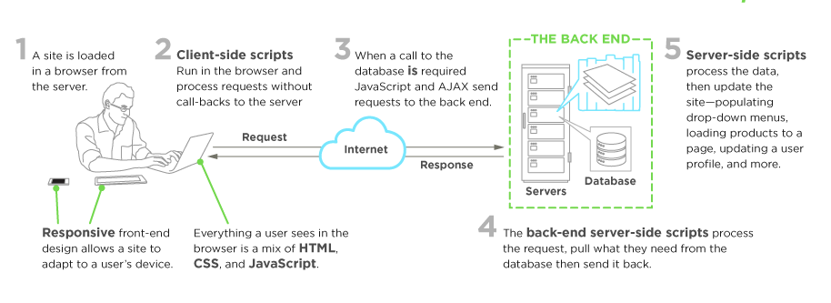

 ## **LuxTech Academy Full Stack Web Development Course.** 

 This will be a comprehesive course, where we will handle frontend and backend software development. 

Front-end web development, also known as client-side development is the practice of producing HTML, CSS and JavaScript for a website or Web Application so that a user can see and interact with them directly. The challenge associated with front end development is that the tools and techniques used to create the front end of a website change constantly and so the developer needs to constantly be aware of how the field is developing.

The objective of designing a site is to ensure that when the users open up the site they see the information in a format that is easy to read and relevant. This is further complicated by the fact that users now use a large variety of devices with varying screen sizes and resolutions thus forcing the designer to take into consideration these aspects when designing the site. They need to ensure that their site comes up correctly in different browsers (cross-browser), different operating systems (cross-platform) and different devices (cross-device), which requires careful planning on the side of the developer.

 

A **front-end developer** architects and develops websites and web applications using web technologies (i.e., HTML, CSS, and JavaScript), which typically runs on the Open Web Platform or acts as compilation input for non-web platform environments (i.e., React Native).

A person enters into the field of front-end development by learning to build a website or web application which relies on HTML, CSS, and JavaScript and commonly runs in a web browser but can also run in a headless browser, WebView, or as compilation input for a native runtime environment. 

**We will oosely strive to follow the process outlined below:**

- Learn, roughly, how the web platform works. Make sure we know the "what" and "where" of HTML, CSS, DOM, JavaScript, Domains, DNS, URLs, HTTP, browsers, and servers/hosting. We won't dive deep on anything just yet, we will just aim to understand the parts at play and how they loosely fit together and start by building simple web pages.

- Learn HTML

- Learn CSS

- Learn JavaScript

- Learn DOM

- Learn the fundamentals of user interface design (i.e. UI patterns, interaction design, user experience design, and usability).

- Learn CLI/command line

- Learn the practice of software engineering (i.e., Application design/architecture, templates, Git, testing, monitoring, automating, code quality, development methodologies).

- Get opinionated and customize your tool box with whatever makes sense to your brain (e.g. Webpack, React, and Mobx).

- Learn Node.js 

**Note we will follow Lux Tech Academy philosophy:**

**Learning the actual underlying technologies, before learning abstractions.**

- Don't learn jQuery, learn the DOM.
- Don't learn SASS, learn CSS. 
- Don't learn JSX, learn HTML. 
- Don't learn TypeScript, learn JavaScript.
- Don't learn Handlebars, learn JavaScript ES6 templates.
- Don't just use Bootstrap, learn UI patterns. 

### **Potential Front-end Developer Skills.**

**The following core web technologies are employed by front-end developers:**

- Hyper Text Markup Language (aka HTML)

- Cascading Style Sheets (aka CSS)

- Uniform Resource Locators (aka URLs)

- Hypertext Transfer Protocol (aka HTTP)

- JavaScript Programming Language (aka ECMAScript 262)

- JavaScript Object Notation (aka JSON)

- Document Object Model (aka DOM)

- Web APIs (aka HTML5 and friends or Browser APIs)

- Web Content Accessibility Guidelines (aka WCAG) & Accessible Rich Internet Applications (aka ARIA)